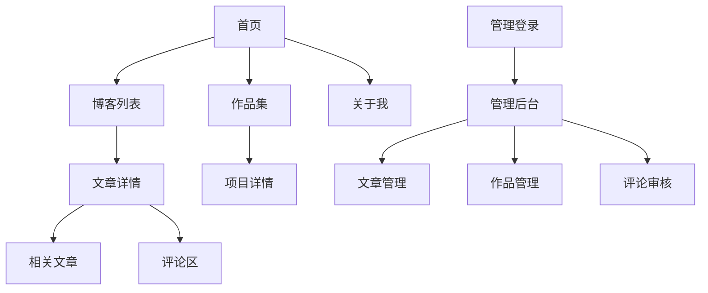

## 1. 产品概述
个人博客重建项目，集成作品集展示功能。保留现有博客文章管理功能，新增丰富的交互体验和现代化的视觉设计。

目标用户：个人开发者、设计师、技术写作者，用于展示个人作品、分享技术文章、建立个人品牌。

## 2. 核心功能

### 2.1 用户角色
| 角色 | 注册方式 | 核心权限 |
|------|----------|----------|
| 访客用户 | 无需注册 | 浏览文章、查看作品集、搜索内容、RSS订阅 |
| 管理员 | 邮箱登录 | 文章CRUD、作品集管理、评论审核、系统配置 |

### 2.2 功能模块
博客系统包含以下核心页面：
1. **首页**：个人简介、最新文章、精选作品、技能展示、联系方式
2. **博客列表页**：文章列表、分类筛选、标签云、搜索功能、分页加载
3. **文章详情页**：文章内容、相关推荐、评论区、分享功能、阅读进度
4. **作品集页**：项目展示、技术栈标签、项目链接、截图展示
5. **关于我页**：详细介绍、技能图谱、工作经历、教育背景
6. **管理后台**：文章编辑、草稿管理、媒体库、评论管理、数据统计

### 2.3 页面详情
| 页面名称 | 模块名称 | 功能描述 |
|----------|----------|----------|
| 首页 | 英雄区域 | 展示个人头像、姓名、职位、社交链接，支持打字机动画效果 |
| 首页 | 最新文章 | 展示最近发布的3-5篇文章，包含标题、摘要、发布时间、阅读时长 |
| 首页 | 精选作品 | 轮播展示3个代表性项目，包含项目名称、技术栈、项目链接 |
| 首页 | 技能展示 | 可视化展示技术技能，支持进度条或标签云形式 |
| 博客列表页 | 文章列表 | 卡片式布局展示文章，包含封面图、标题、摘要、标签、发布时间 |
| 博客列表页 | 分类筛选 | 侧边栏展示文章分类，支持多选筛选 |
| 博客列表页 | 搜索功能 | 实时搜索文章标题和内容，支持关键词高亮 |
| 文章详情页 | 文章内容 | 支持Markdown渲染、代码高亮、数学公式、图片懒加载 |
| 文章详情页 | 阅读进度 | 顶部进度条显示阅读进度，支持章节导航 |
| 文章详情页 | 评论区 | 支持访客评论、管理员回复、评论点赞、反垃圾验证 |
| 作品集页 | 项目网格 | 瀑布流或卡片网格展示所有项目，支持筛选和排序 |
| 作品集页 | 项目详情 | 点击项目展开详情模态框，展示项目描述、技术栈、截图 |
| 关于我页 | 个人简介 | 详细的个人介绍，支持时间轴展示经历 |
| 关于我页 | 技能图谱 | 交互式技能树或雷达图展示技术能力 |
| 管理后台 | 文章编辑 | 富文本编辑器支持Markdown、实时预览、自动保存 |
| 管理后台 | 媒体管理 | 图片上传、压缩、CDN加速、相册管理 |

## 3. 核心流程

### 访客用户流程
访客访问首页 → 浏览文章或作品集 → 阅读详细内容 → 搜索感兴趣的内容 → 订阅RSS或分享文章

### 管理员流程
管理员登录 → 进入管理后台 → 发布/编辑文章 → 管理评论 → 更新作品集 → 查看访问统计

## 4. 用户界面设计

### 4.1 设计规范
**色彩方案**
- 主色调：#1a1a1a（深灰黑）
- 强调色：#3b82f6（蓝色）
- 背景色：#ffffff（白色）
- 辅助色：#6b7280（中灰）
- 成功色：#10b981（绿色）
- 警告色：#f59e0b（橙色）
- 错误色：#ef4444（红色）

**字体系统**
- 标题字体：Inter, -apple-system, BlinkMacSystemFont, sans-serif
- 正文字体：Inter, -apple-system, BlinkMacSystemFont, sans-serif
- 代码字体：JetBrains Mono, Consolas, Monaco, monospace
- 标题字号：3rem/2.5rem/2rem/1.5rem
- 正文字号：1rem/0.875rem
- 行高：1.5-1.75

**组件规范**
- 按钮：圆角8px，padding 12px 24px，hover状态透明度0.9
- 卡片：圆角12px，阴影0 4px 6px -1px rgba(0,0,0,0.1)
- 输入框：圆角6px，border 1px solid #e5e7eb
- 动效：transition duration 200ms，ease-in-out

**无障碍标准**
- 颜色对比度：≥4.5:1（WCAG 2.1 AA级）
- 焦点指示器：2px实线边框，颜色#3b82f6
- 键盘导航：所有交互元素支持Tab键导航
- 屏幕阅读器：语义化HTML标签，ARIA标签

### 4.2 页面设计概览
| 页面名称 | 模块名称 | UI元素 |
|----------|----------|----------|
| 首页 | 英雄区域 | 全宽背景渐变，居中头像圆形200px，打字机动画效果，社交图标横向排列 |
| 首页 | 文章卡片 | 横向布局，左侧缩略图16:9比例，右侧内容区域，底部标签和元信息 |
| 博客列表页 | 筛选侧边栏 | 左侧固定宽度280px，粘性定位，分类树形结构，标签云 |
| 文章详情页 | 内容区域 | 最大宽度768px居中，代码块暗色主题，图片圆角8px，引用样式左侧边框 |
| 作品集页 | 项目网格 | 响应式网格，最小宽度300px，悬停放大效果，技术栈标签 |

### 4.3 响应式设计
- 桌面优先设计，断点：640px、768px、1024px、1280px
- 移动端优化：触摸目标≥44px，字体≥16px防止缩放
- 平板适配：侧边栏转为抽屉菜单，网格布局调整

### 4.4 交互动效
- 页面切换：淡入淡出300ms
- 卡片悬停：上升4px，阴影加深
- 按钮点击：缩放0.95
- 加载动画：骨架屏渐进式显示
- 滚动动画：元素进入视口时淡入上移