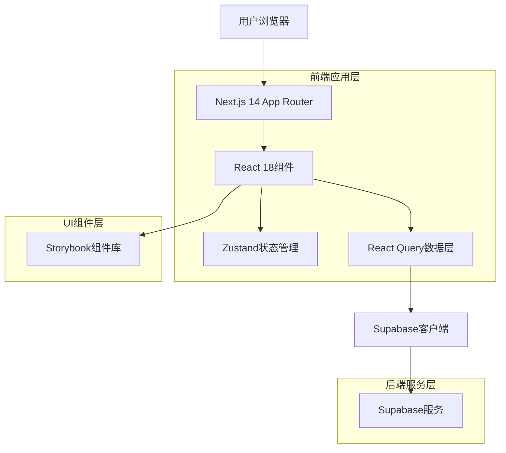
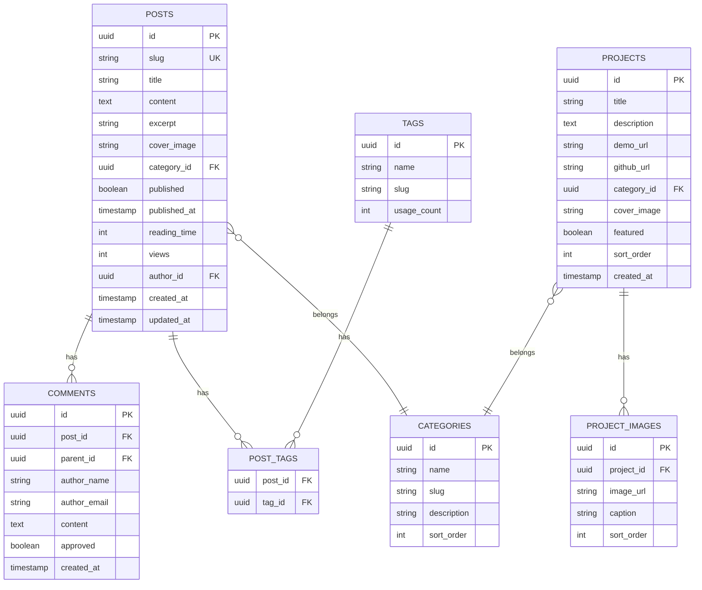

## 1. 架构设计



## 2. 技术描述

**核心技术栈**
- 前端框架：Next.js 14 (App Router) + React 18
- 类型系统：TypeScript 5
- 样式方案：Tailwind CSS 3
- 状态管理：Zustand 4
- 数据获取：React Query 4 (TanStack Query)
- 后端服务：Supabase (PostgreSQL + Auth + Storage)
- 初始化工具：create-next-app

**开发工具链**
- 包管理：pnpm
- 代码检查：ESLint + Prettier
- 提交规范：Husky + lint-staged + Conventional Commits
- 组件文档：Storybook 7
- 测试框架：Jest + Testing Library + Cypress

**性能优化库**
- 图片优化：next/image
- 字体优化：next/font
- 代码分割：动态导入
- 缓存策略：React Query + Next.js缓存

## 3. 路由定义

| 路由路径 | 用途描述 | 页面类型 |
|----------|----------|----------|
| `/` | 首页，展示个人简介和精选内容 | 静态页面 |
| `/blog` | 博客列表页，文章列表和筛选 | 静态页面 + ISR |
| `/blog/[slug]` | 文章详情页，Markdown渲染 | 静态页面 + ISR |
| `/portfolio` | 作品集页面，项目展示 | 静态页面 |
| `/portfolio/[id]` | 项目详情页，具体项目介绍 | 静态页面 |
| `/about` | 关于我页面，个人信息展示 | 静态页面 |
| `/admin` | 管理后台登录页 | 动态页面 |
| `/admin/dashboard` | 管理后台主面板 | 动态页面 + 权限验证 |
| `/admin/posts` | 文章管理列表 | 动态页面 + 权限验证 |
| `/admin/posts/new` | 新建文章页面 | 动态页面 + 权限验证 |
| `/admin/posts/[id]/edit` | 编辑文章页面 | 动态页面 + 权限验证 |
| `/api/revalidate` | 缓存刷新API | API路由 |

## 4. API定义

### 4.1 博客文章API

**获取文章列表**
```http
GET /api/posts?page=1&limit=10&category=tech&tag=react
```

请求参数：
| 参数名 | 类型 | 必需 | 描述 |
|--------|------|------|------|
| page | number | 否 | 页码，默认1 |
| limit | number | 否 | 每页数量，默认10 |
| category | string | 否 | 分类筛选 |
| tag | string | 否 | 标签筛选 |

响应数据：
```typescript
interface PostListResponse {
  posts: Post[]
  total: number
  page: number
  limit: number
  hasMore: boolean
}

interface Post {
  id: string
  slug: string
  title: string
  excerpt: string
  coverImage: string
  category: string
  tags: string[]
  publishedAt: string
  readingTime: number
  views: number
}
```

**获取文章详情**
```http
GET /api/posts/[slug]
```

响应数据：
```typescript
interface PostDetail extends Post {
  content: string
  author: Author
  relatedPosts: Post[]
  comments: Comment[]
}
```

### 4.2 评论API

**发表评论**
```http
POST /api/posts/[slug]/comments
```

请求体：
```typescript
interface CreateCommentRequest {
  content: string
  authorName: string
  authorEmail: string
  parentId?: string
}
```

## 5. 数据模型

### 5.1 数据库实体关系图



### 5.2 数据库表结构定义

**文章表 (posts)**
```sql
CREATE TABLE posts (
    id UUID PRIMARY KEY DEFAULT gen_random_uuid(),
    slug VARCHAR(255) UNIQUE NOT NULL,
    title VARCHAR(255) NOT NULL,
    content TEXT NOT NULL,
    excerpt VARCHAR(500),
    cover_image VARCHAR(500),
    category_id UUID REFERENCES categories(id),
    published BOOLEAN DEFAULT false,
    published_at TIMESTAMP WITH TIME ZONE,
    reading_time INTEGER DEFAULT 0,
    views INTEGER DEFAULT 0,
    author_id UUID REFERENCES auth.users(id),
    created_at TIMESTAMP WITH TIME ZONE DEFAULT NOW(),
    updated_at TIMESTAMP WITH TIME ZONE DEFAULT NOW()
);

CREATE INDEX idx_posts_slug ON posts(slug);
CREATE INDEX idx_posts_published_at ON posts(published_at DESC);
CREATE INDEX idx_posts_category ON posts(category_id);
```

**分类表 (categories)**
```sql
CREATE TABLE categories (
    id UUID PRIMARY KEY DEFAULT gen_random_uuid(),
    name VARCHAR(100) NOT NULL,
    slug VARCHAR(100) UNIQUE NOT NULL,
    description TEXT,
    sort_order INTEGER DEFAULT 0,
    created_at TIMESTAMP WITH TIME ZONE DEFAULT NOW()
);
```

**标签表 (tags)**
```sql
CREATE TABLE tags (
    id UUID PRIMARY KEY DEFAULT gen_random_uuid(),
    name VARCHAR(50) NOT NULL,
    slug VARCHAR(50) UNIQUE NOT NULL,
    usage_count INTEGER DEFAULT 0,
    created_at TIMESTAMP WITH TIME ZONE DEFAULT NOW()
);
```

**评论表 (comments)**
```sql
CREATE TABLE comments (
    id UUID PRIMARY KEY DEFAULT gen_random_uuid(),
    post_id UUID REFERENCES posts(id) ON DELETE CASCADE,
    parent_id UUID REFERENCES comments(id) ON DELETE CASCADE,
    author_name VARCHAR(100) NOT NULL,
    author_email VARCHAR(255) NOT NULL,
    content TEXT NOT NULL,
    approved BOOLEAN DEFAULT false,
    created_at TIMESTAMP WITH TIME ZONE DEFAULT NOW()
);

CREATE INDEX idx_comments_post_id ON comments(post_id);
CREATE INDEX idx_comments_created_at ON comments(created_at DESC);
```

**项目表 (projects)**
```sql
CREATE TABLE projects (
    id UUID PRIMARY KEY DEFAULT gen_random_uuid(),
    title VARCHAR(255) NOT NULL,
    description TEXT NOT NULL,
    demo_url VARCHAR(500),
    github_url VARCHAR(500),
    category_id UUID REFERENCES categories(id),
    cover_image VARCHAR(500),
    featured BOOLEAN DEFAULT false,
    sort_order INTEGER DEFAULT 0,
    created_at TIMESTAMP WITH TIME ZONE DEFAULT NOW(),
    updated_at TIMESTAMP WITH TIME ZONE DEFAULT NOW()
);

CREATE INDEX idx_projects_featured ON projects(featured);
CREATE INDEX idx_projects_sort_order ON projects(sort_order);
```

### 5.3 Supabase访问权限配置

**公开访问权限**
```sql
-- 文章读取权限
GRANT SELECT ON posts TO anon;
GRANT SELECT ON categories TO anon;
GRANT SELECT ON tags TO anon;
GRANT SELECT ON post_tags TO anon;
GRANT SELECT ON projects TO anon;
GRANT SELECT ON project_images TO anon;
GRANT SELECT ON comments TO anon;
```

**认证用户权限**
```sql
-- 评论写入权限
GRANT INSERT ON comments TO authenticated;

-- 评论策略
CREATE POLICY "允许访客查看已批准评论" ON comments
    FOR SELECT USING (approved = true);

CREATE POLICY "允许认证用户发表评论" ON comments
    FOR INSERT WITH CHECK (true);
```

## 6. 性能优化策略

**核心性能指标**
- First Contentful Paint (FCP) ≤ 1.8s
- Largest Contentful Paint (LCP) ≤ 2.5s  
- Time to Interactive (TTI) ≤ 3.5s
- Cumulative Layout Shift (CLS) ≤ 0.1
- First Input Delay (FID) ≤ 100ms

**优化措施**
1. 图片优化：WebP格式、响应式图片、懒加载
2. 字体优化：字体子集化、预加载关键字体
3. 代码分割：路由级代码分割、动态导入
4. 缓存策略：静态资源长期缓存、API响应缓存
5. CDN加速：静态资源CDN分发
6. 预渲染：关键页面静态生成

## 7. 测试策略

**单元测试**
- 框架：Jest + Testing Library
- 覆盖率目标：≥80%
- 测试范围：工具函数、自定义Hook、组件逻辑

**集成测试**
- 框架：Cypress
- 测试场景：用户核心流程、关键交互
- 测试环境：CI/CD流水线

**性能测试**
- 工具：Lighthouse CI
- 测试指标：Core Web Vitals
- 目标分数：≥90分

**可访问性测试**
- 工具：axe-core、WAVE
- 标准：WCAG 2.1 AA级
- 自动化检查：集成到CI流程

## 8. 部署配置

**环境变量**
```bash
# Supabase配置
NEXT_PUBLIC_SUPABASE_URL=
NEXT_PUBLIC_SUPABASE_ANON_KEY=
SUPABASE_SERVICE_ROLE_KEY=

# 站点配置
NEXT_PUBLIC_SITE_URL=
NEXT_PUBLIC_SITE_NAME=
NEXT_PUBLIC_SITE_DESCRIPTION=

# 分析工具
NEXT_PUBLIC_GA_ID=
NEXT_PUBLIC_SENTRY_DSN=

# 性能监控
NEXT_PUBLIC_WEB_VITALS_API=
```

**CI/CD配置**
- 平台：GitHub Actions
- 流程：代码检查 → 测试 → 构建 → 部署
- 预览部署：每个PR自动生成预览环境
- 生产部署：主分支自动部署到Vercel